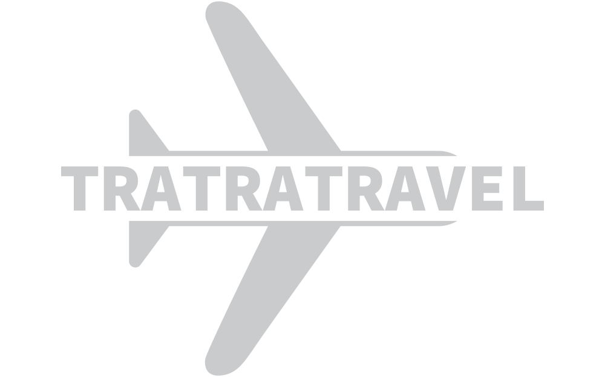

# DESAFIO DE TRIPULACIONES --TraTraTravel
## Objetivo

Este proyecto se centra en la necesidad de crear una aplicación web con recomendaciones de destinos turísticos nacionales a usuarios a través de búsquedas totalmente basadas en la inteligencia artificial.  

Fomentar el turismo español, es uno de nuestros objetivos, ya que es uno de los pilares económicos de nuestro país (contribución del 12% del PIB aproximadamente).

Utilizaremos Chat GPT-3 para proporcionar recomendaciones personalizadas y para responder preguntas sobre los destinos de viajes sugeridos. En resumen, nuestra aplicación web es una herramienta completa para planificar viajes que utiliza la tecnología de última generación para proporcionar recomendaciones personalizadas y ayudar a los usuarios a organizar sus viajes de manera fácil y eficiente. 

## Estructura
Los datos utilizados para el análisis se encuentran en el directorio datos. El análisis ha sido realizado utilizando notebooks de Jupiter (directorio notebooks). 

### Autores
Equipo Full Stack:
* Fulgencio Díaz
* Ismael Escalante
* Rufino Polvillo
* Luis Felipe Rucinque
  
Equipo Data Science:
* Alberto Lázaro
* Mario Ochoa
* Javier López
* Rocío Ruiz
  
Tutorizados por José Luis Sanjurjo

